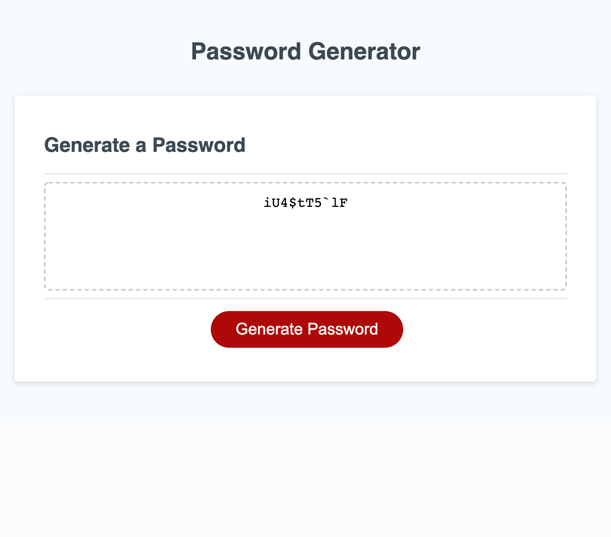

# Password Generator Starter Code

## Purpose
Develop a webpage password generator. The password generator takes several user desired selections and generate a 
password based on these selections.

## Built With
* HTML
* CSS
* JavaScrip

## Website
https://omcewan.github.io/mcewans-pwd-generator/

## Screenshot
The following image is a screenshot of the webpage with a sample password generated:

